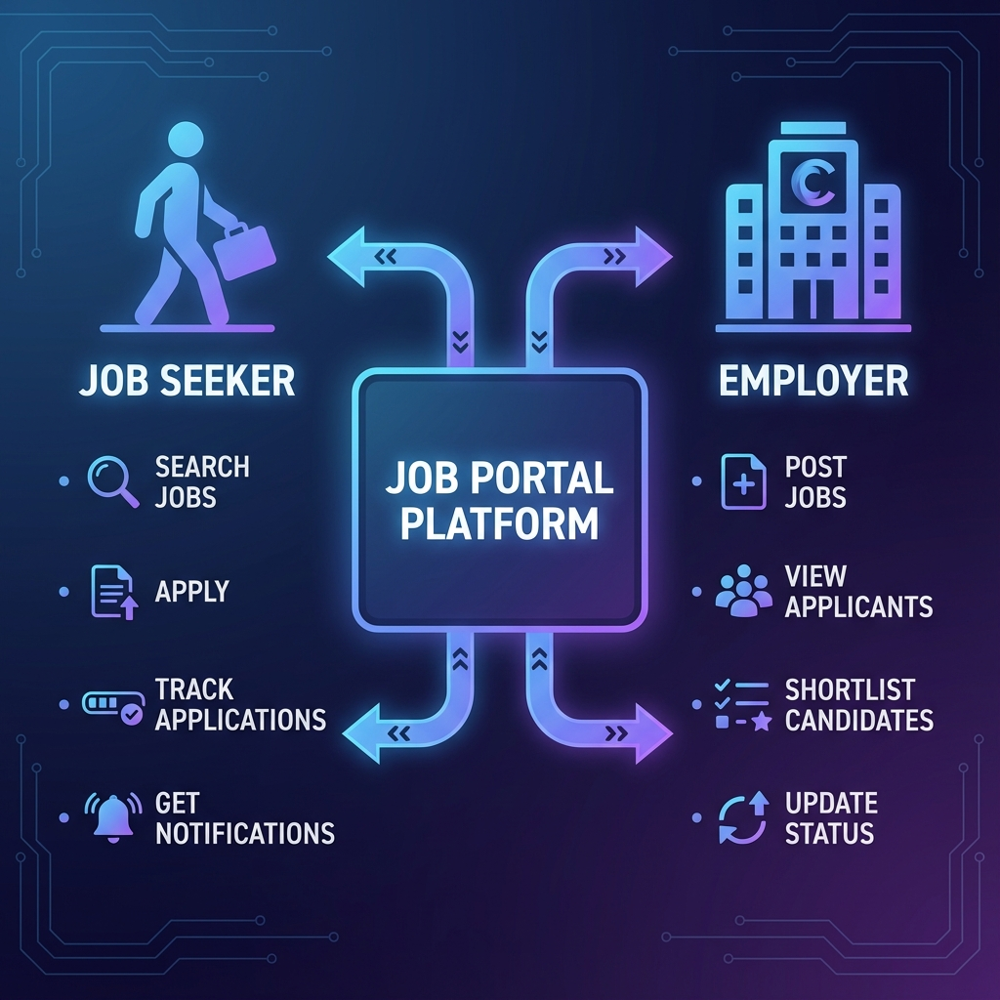
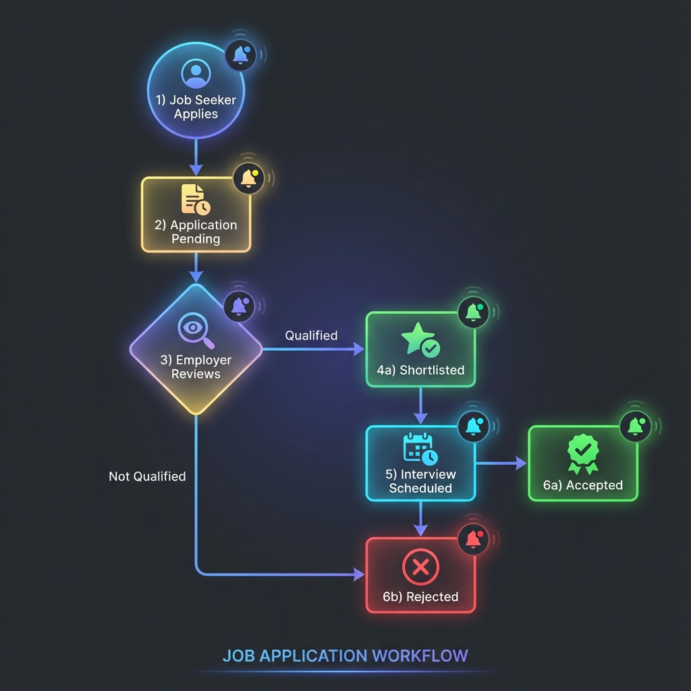
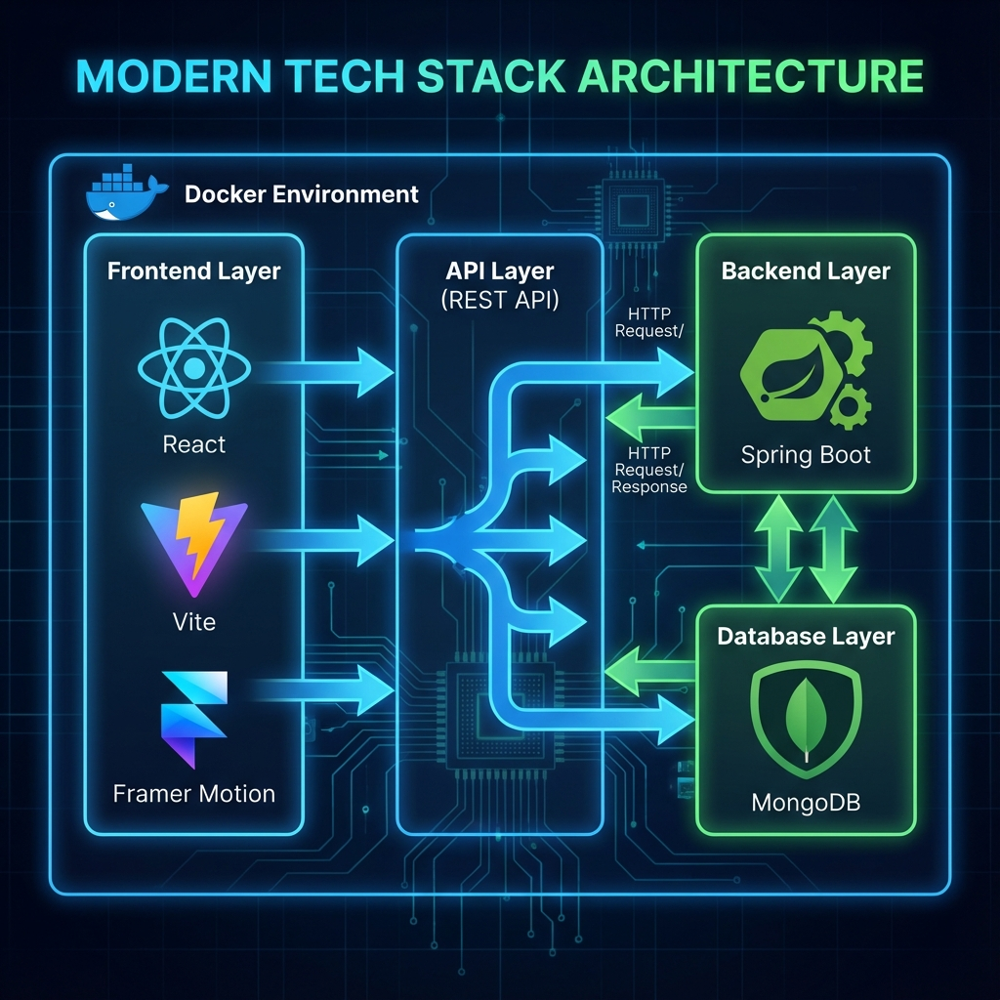

<p align="center">
  
  
  
  
</p>

<h1 align="center">🚀 Job Search Portal</h1>

<p align="center">
  <strong>A modern, full-stack job portal connecting talented professionals with top employers</strong>
</p>

<p align="center">
  <a href="#-features">Features</a> •
  <a href="#-architecture">Architecture</a> •
  <a href="#-quick-start">Quick Start</a> •
  <a href="#-api-reference">API</a> •
  <a href="#-deployment">Deployment</a>
</p>

---

## 🎯 User Roles & Features

<p align="center">
  
</p>

### 👤 Job Seekers
| Feature | Description |
|---------|-------------|
| 🔍 **Smart Search** | Filter jobs by location, salary, type, and skills |
| 📝 **One-Click Apply** | Apply with saved profile and resume |
| 📊 **Track Applications** | Monitor status from pending to accepted |
| 🔔 **Real-time Alerts** | Get notified with employer contact info |
| 💾 **Save Jobs** | Bookmark jobs for later |

### 🏢 Employers
| Feature | Description |
|---------|-------------|
| 📋 **Post Jobs** | Create detailed listings with rich descriptions |
| 👥 **View Applicants** | See candidates with email and profile |
| ⭐ **Shortlist Workflow** | Shortlist → Interview → Accept/Reject |
| 📈 **Dashboard** | Track applications and hiring metrics |

---

## � Application Workflow

<p align="center">
  
</p>

### Status Flow

```
┌─────────────┐     ┌─────────────┐     ┌─────────────┐
│  📝 APPLY   │────▶│  ⏳ PENDING │────▶│  👀 REVIEW  │
└─────────────┘     └─────────────┘     └──────┬──────┘
                                               │
                    ┌──────────────────────────┼──────────────────────────┐
                    ▼                          ▼                          ▼
           ┌─────────────┐            ┌─────────────┐            ┌─────────────┐
           │ ⭐ SHORTLIST │───────────▶│ 📅 INTERVIEW│            │  ❌ REJECT  │
           └─────────────┘            └──────┬──────┘            └─────────────┘
                                             │
                              ┌──────────────┴──────────────┐
                              ▼                              ▼
                     ┌─────────────┐                ┌─────────────┐
                     │  ✅ ACCEPT  │                │  ❌ REJECT  │
                     └─────────────┘                └─────────────┘
```

> 🔔 **Notifications**: Job seekers receive real-time notifications with employer email at each status change.

---

## 🏗 Architecture

<p align="center">
  
</p>

### Tech Stack

| Layer | Technologies |
|-------|--------------|
| **Frontend** | React 18, Vite, Framer Motion, Axios, CSS3 |
| **Backend** | Spring Boot 3.2, Spring Security, Spring Data MongoDB |
| **Database** | MongoDB 7.0 (NoSQL) |
| **Auth** | JWT with BCrypt password hashing |
| **DevOps** | Docker, Docker Compose, Nginx |

---

## 🚀 Quick Start

### Prerequisites

- **Docker Desktop** (recommended) OR
- Node.js 18+, Java 17+, MongoDB 7+

### Option 1: Docker (Recommended) 🐳

```bash
# Clone the repository
git clone https://github.com/yourusername/job-search-portal.git
cd job-search-portal

# Start all services
docker-compose up --build

# Access the app
# Frontend: http://localhost:80
# Backend:  http://localhost:8080
```

### Option 2: Development Mode 💻

**Terminal 1 - Backend:**
```bash
cd backend
mvn spring-boot:run
```

**Terminal 2 - Frontend:**
```bash
cd frontend
npm install
npm run dev
```

| Service | URL |
|---------|-----|
| Frontend | `http://localhost:5173` |
| Backend API | `http://localhost:8080` |

---

## 📁 Project Structure

```
job-search-portal/
│
├── 📂 frontend/                   # React SPA (Vite)
│   ├── src/
│   │   ├── components/           # Reusable UI components
│   │   │   ├── JobCard/
│   │   │   ├── Navbar/
│   │   │   └── Notifications/
│   │   ├── pages/                # Route pages
│   │   │   ├── JobListings.jsx
│   │   │   ├── JobDetails.jsx
│   │   │   ├── Applications.jsx
│   │   │   └── EmployerDashboard.jsx
│   │   ├── context/              # React Context (Auth)
│   │   └── api/                  # Axios configuration
│   └── Dockerfile
│
├── 📂 backend/                    # Spring Boot REST API
│   ├── src/main/java/com/jobportal/
│   │   ├── controller/           # REST endpoints
│   │   ├── service/              # Business logic
│   │   ├── repository/           # MongoDB repositories
│   │   ├── model/                # Entity models
│   │   ├── dto/                  # Data transfer objects
│   │   └── security/             # JWT & Spring Security
│   └── Dockerfile
│
├── 📂 docs/images/                # Documentation assets
├── docker-compose.yml             # Multi-container orchestration
└── README.md
```

---

## 🔌 API Reference

### 🔐 Authentication

| Method | Endpoint | Description | Body |
|--------|----------|-------------|------|
| `POST` | `/api/auth/register` | Register user | `{ email, password, role, firstName, lastName }` |
| `POST` | `/api/auth/login` | Login | `{ email, password }` |

### 💼 Jobs

| Method | Endpoint | Description | Auth |
|--------|----------|-------------|------|
| `GET` | `/api/jobs` | List all jobs | - |
| `GET` | `/api/jobs/:id` | Get job details | - |
| `GET` | `/api/jobs/search?keyword=` | Search jobs | - |
| `GET` | `/api/jobs/employer/:id` | Employer's jobs | 🔒 Employer |
| `POST` | `/api/jobs` | Create job | 🔒 Employer |
| `PUT` | `/api/jobs/:id` | Update job | 🔒 Employer |
| `DELETE` | `/api/jobs/:id` | Delete job | 🔒 Employer |

### 📋 Applications

| Method | Endpoint | Description | Auth |
|--------|----------|-------------|------|
| `POST` | `/api/applications` | Submit application | 🔒 Job Seeker |
| `GET` | `/api/applications/applicant/:id` | My applications | 🔒 Job Seeker |
| `GET` | `/api/applications/job/:id` | Job applicants | 🔒 Employer |
| `PATCH` | `/api/applications/:id/status` | Update status | 🔒 Employer |

### 🔔 Notifications

| Method | Endpoint | Description | Auth |
|--------|----------|-------------|------|
| `GET` | `/api/notifications` | Get notifications | 🔒 |
| `PUT` | `/api/notifications/:id/read` | Mark as read | 🔒 |

---

## 🐳 Deployment

### Docker Commands

```bash
# Build and start (foreground)
docker-compose up --build

# Build and start (background)
docker-compose up -d --build

# View logs
docker-compose logs -f

# Stop all services
docker-compose down

# Stop and remove volumes
docker-compose down -v
```

### Environment Variables

| Variable | Description | Default |
|----------|-------------|---------|
| `MONGODB_URI` | MongoDB connection | `mongodb://mongodb:27017/jobportal` |
| `JWT_SECRET` | JWT signing secret | Auto-generated |
| `JWT_EXPIRATION` | Token expiry (ms) | `86400000` (24h) |

---

## 🔒 Security Features

- ✅ **JWT Authentication** - Stateless, secure token-based auth
- ✅ **BCrypt Password Hashing** - Industry-standard encryption
- ✅ **Role-Based Access Control** - Separate permissions for Job Seekers & Employers
- ✅ **Protected API Endpoints** - Spring Security guards sensitive routes
- ✅ **CORS Configuration** - Controlled cross-origin access

---

## 🤝 Contributing

1. **Fork** the repository
2. **Create** your feature branch: `git checkout -b feature/AmazingFeature`
3. **Commit** changes: `git commit -m 'Add AmazingFeature'`
4. **Push** to branch: `git push origin feature/AmazingFeature`
5. **Open** a Pull Request

---

## 📄 License

This project is licensed under the **MIT License** - see the [LICENSE](LICENSE) file for details.

---

<p align="center">
  <strong>Built with ❤️ using React, Spring Boot & MongoDB</strong>
</p>

<p align="center">
  ⭐ Star this repo if you found it helpful!
</p>
